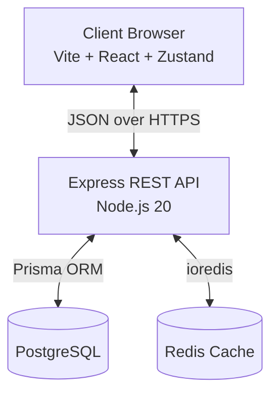
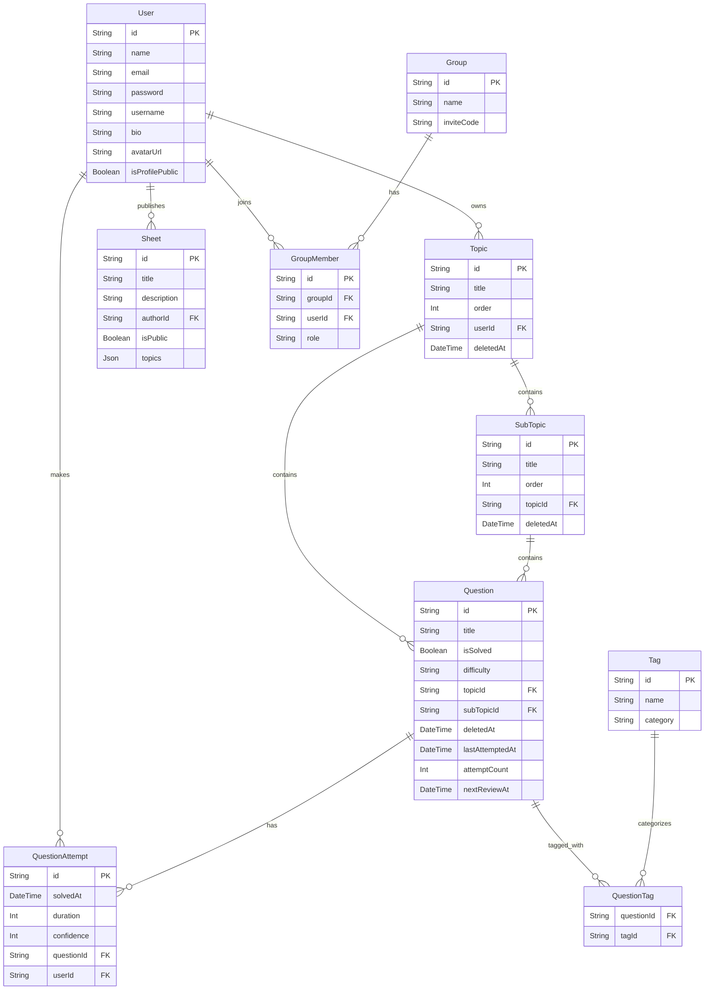

# AlgoForge Architecture

AlgoForge is a full-stack Data Structures and Algorithms (DSA) preparation platform. This document outlines the system design, technical decisions, and data flow.

## 1. High-Level System Overview

## 2. Backend Architecture (Layered)

The backend follows a strict layered architecture to separate concerns, making the system testable and maintainable.

| Layer | Responsibility | Technologies |
|---|---|---|
| **Shared** | Zod schemas and TypeScript types shared across apps. | `@algoforge/shared` |
| **Routes** | Defines API endpoints and attaches middleware. | Express Router |
| **Middleware** | Intercepts requests for auth, validation, and security. | Zod, Helmet, JWT |
| **Controllers** | Thin adapters. Parses `req`, calls Service, sends `res`. | Express 5 |
| **Services** | Core business logic. No HTTP knowledge. | TypeScript |
| **Data Access** | Queries the database and cache. | Prisma, ioredis |

## 3. Authentication & Security Pipeline

AlgoForge uses stateless JWT authentication via `HttpOnly` cookies to protect against XSS attacks.

**Middleware Pipeline Order:**
1. `helmet()` — Sets secure HTTP headers and Content Security Policy (CSP).
2. `rateLimit()` — Prevents brute-force and DDoS (100 req / 15 min globally, strict on auth).
3. `sanitize()` — Strips dangerous keys from `req.body`.
4. `cookieParser()` — Parses `HttpOnly` cookies.
5. `doubleCsrfProtection` — Validates CSRF tokens using the Double Submit Cookie pattern.
6. `requestId` / `requestLogger` — Injects traceability UUIDs and logs via Pino.
7. `protect` (Route-level) — Verifies JWT signature and expiry.
8. `validate` (Route-level) — Strict Zod schema enforcement.

## 4. Frontend Architecture

- **Routing:** `react-router-dom` is used for multi-page routing, featuring `AuthLayout` for public routes and `AppLayout` with `ProtectedRoute` for authenticated sessions.
- **State Management:**
  - **Server State:** `@tanstack/react-query` handles all API communication, caching, synchronization, and optimistic UI updates for rapid interactions.
  - **UI State:** `Zustand` is restricted strictly to global transient UI states (like command palette visibility and navigation targets), chosen for its lightweight API.
- **Component Design:** The codebase follows a feature-based architecture (`features/sheet`, `shared`) prioritizing focused, decomposed components over monoliths.
- **Drag-and-Drop & Virtualization:** `@dnd-kit` powers the reordering of topics, subtopics, and questions. Long lists (like the main sheet) are virtualized using `@tanstack/react-virtual` to optimize DOM node counts and rendering performance for massive curriculums.

## 5. Caching Strategy

The most expensive operation in the system is fetching a user's full topic tree (Topics → SubTopics → Questions). This is optimized using a **Cache-Aside** pattern with Redis.

- **Key Format:** `topics:{userId}`
- **TTL:** 5 minutes
- **Invalidation:** Tag-based. The cache is tagged with `user:{userId}`. Any write operation (create, update, delete, reorder) in any service immediately invalidates the tag, ensuring absolute consistency.
- **Graceful Degradation:** If Redis is down or `REDIS_URL` is omitted, the `cache` utility silently falls back to direct Postgres queries without crashing the app.

## 6. Data Model (PostgreSQL)

## 7. Intelligence Layer & Spaced Repetition

AlgoForge incorporates an intelligent learning system to optimize study efficiency:

- **Spaced Repetition (SM-2 Variant):** Questions are scheduled for review based on a modified SM-2 algorithm. When a user submits an attempt, they provide a self-evaluated confidence score (1-5). The system calculates the next optimal review date (`nextReviewAt`) to maximize retention.
- **Analytics Engine:** The `analytics.service.ts` heavily leverages Prisma aggregation queries over the `QuestionAttempt` table to compute streaks, weekly velocity, and topic-specific mastery percentages.
- **Daily Practice Plans:** The `practice.service.ts` dynamically generates a daily practice session by pulling from three strategic queues:
  1. **Review Queue:** Questions due for spaced repetition today.
  2. **Weak Areas:** Topics where the user's mastery percentage is under 50%.
  3. **Random Exploration:** A selection of completely unsolved questions to introduce new concepts.

## 8. Social & Growth Features

AlgoForge includes networking effects designed to encourage collaborative learning:
- **Public Profiles**: Users can opt-in to display their statistics, heatmap, and bio on a public `/u/username` page.
- **Sheet Templates**: Users can publish a snapshot of their current topic tree to the public directory, allowing others to discover and clone curated question lists.
- **Study Groups**: Users can form study groups by generating an invite code. Group leaderboards track weekly problem-solving velocity among peers.

## 9. Error Handling

Express 5 natively catches rejected promises, eliminating the need for `try/catch` in controllers. Errors bubble up to `errorHandler.ts`, which categorizes them:
- **ZodError:** 400 Bad Request with field-level details.
- **CSRF Error:** 403 Forbidden on invalid or missing tokens.
- **Prisma Errors:** e.g., `P2002` maps to 409 Conflict.
- **AppError:** Custom operational errors (e.g., 404 Not Found, 403 Forbidden).
- **Unknown Errors:** Captured by Sentry (`@sentry/node` & `@sentry/react`), logged via Pino, and obscured as 500 Internal Server Error to prevent leaking stack traces.

## 9. Testing Infrastructure

- **Backend:** Vitest + Supertest.
- **Frontend:** Vitest + React Testing Library (`@testing-library/react` and `@testing-library/jest-dom`).
- **End-to-End (E2E):** Playwright for full browser integration tests.
- **Mocking:** `vitest-mock-extended` deeply mocks the `PrismaClient` and Redis utility.
- **Advantage:** Unit tests run entirely in-memory at lightning speed without requiring a live Docker database container, while E2E tests provide confidence in user flows.

## 10. Containerization

The project uses multi-stage Docker builds to minimize image sizes.
- **Builder Stage:** Installs all `devDependencies` and compiles TypeScript / Vite.
- **Runner Stage:** Copies only the compiled `dist/` folders and installs production dependencies, reducing attack surface and container size.
