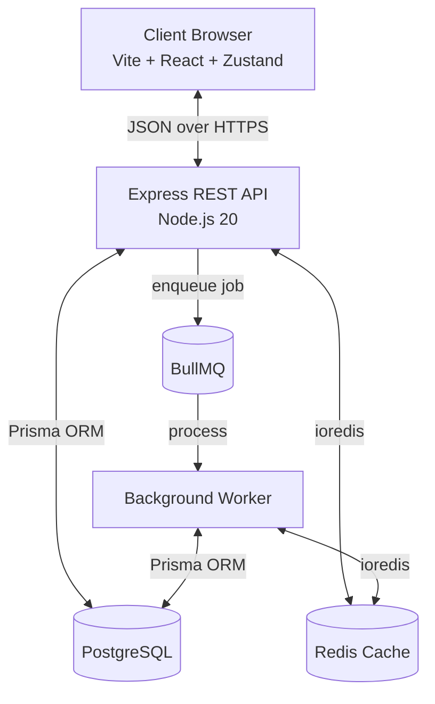
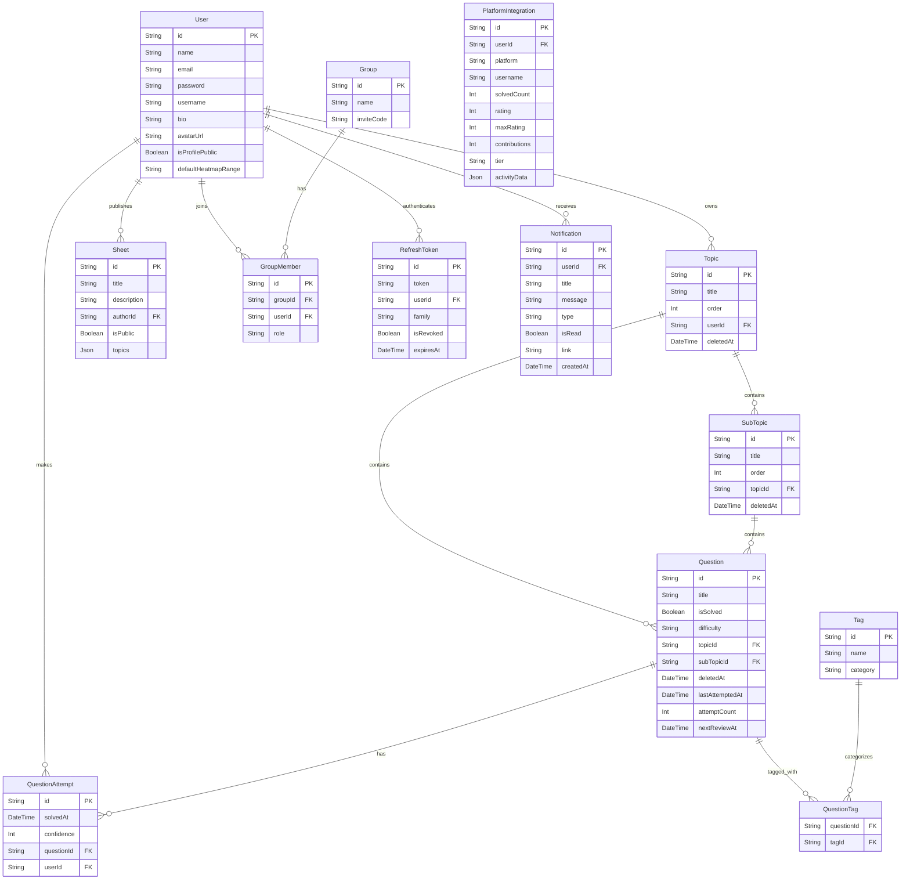

# AlgoForge Architecture

AlgoForge is a full-stack Data Structures and Algorithms (DSA) preparation platform. This document outlines the system design, technical decisions, and data flow.

## 1. High-Level System Overview



## 2. Backend Architecture (Layered)

The backend follows a strict layered architecture to separate concerns, making the system testable and maintainable.

| Layer | Responsibility | Technologies |
|---|---|---|
| **Shared** | Zod schemas and TypeScript types shared across apps. | `@algoforge/shared` |
| **Routes** | Defines API endpoints and attaches middleware & rate limiters. | Express Router |
| **Middleware** | Intercepts requests for auth, validation, and rate limiting. | Zod, Helmet, JWT, Rate Limit |
| **Controllers** | Thin adapters. Parses `req`, calls Service, sends `res`. | Express 5 |
| **Services** | Core business logic. No HTTP knowledge. | TypeScript |
| **Repositories** | Dedicated Data Access Layer (Class-based singletons). Encapsulates database queries including SQL-native analytics aggregations and heatmaps. | Prisma ORM, raw PostgreSQL, ioredis |

## 3. Authentication & Security Pipeline

AlgoForge uses stateless JWT authentication via `HttpOnly` cookies to protect against XSS attacks.

**Middleware & Token Pipeline Order:**
1. `helmet()` — Sets secure HTTP headers and Content Security Policy (CSP).
2. `rateLimit()` — Granular limiters (global + strict limits for login/register/refresh/sync/analytics).
3. `sanitize()` — Strips dangerous keys to prevent NoSQL injection and Prototype Pollution.
4. `cookieParser()` — Parses `HttpOnly` cookies.
5. `doubleCsrfProtection` — Validates CSRF tokens using the Double Submit Cookie pattern.
6. `requestId` / `requestLogger` — Injects traceability UUIDs and logs via Pino.
7. `protect` (Route-level) — Verifies JWT signature and expiry.
8. `validate` (Route-level) — Strict Zod schema enforcement using `@algoforge/shared`.

**Session Management & Replay Protection:**
Refresh tokens use a **Token Family Lineage** architecture. Every session has a unique `family` ID. If an already-used (revoked) refresh token is presented again (indicating a potential replay attack or stolen token), the system instantly invalidates the entire token family, terminating all active sessions for that device.

## 4. Frontend Architecture

- **Routing & Layout:** `react-router-dom` is used for multi-page routing, featuring `AuthLayout` for public routes and `AppLayout` with `ProtectedRoute` for authenticated sessions. The `AppLayout` features a resilient, viewport-bounded fixed sidebar (`100dvh`) that ensures stable UI transitions without layout shifts.
- **Global Command Palette (`Ctrl+K`):** Mounted globally in `AppLayout.tsx`, allowing instant keyboard navigation across topics, questions, and pages from anywhere in the application.
- **Notifications System:** A header notification bell backed by `useNotifications` polling query renders real-time alerts (e.g. background sync completion) with unread counters and one-click mark-as-read functionality.
- **Unified Multi-Platform Dashboard:** The analytics dashboard combines native sheet attempts with third-party sync data (LeetCode, Codeforces). Users can interactively filter between "All Platforms", "AlgoForge Sheets", "LeetCode", and "Codeforces". Streaks are dynamically computed from the combined activity heatmap.
- **State Management:**
  - **Server State:** `@tanstack/react-query` handles all API communication, caching, synchronization, and optimistic UI updates (e.g., instant toggling of `isSolved` and `isStarred`).
  - **UI State:** `Zustand` (`useUIStore`) is restricted strictly to global transient UI states (like command palette visibility and navigation targets).
- **Component Design & UX Polish:** Built with modern design tokens, branded `<LoadingSpinner>` glowing spinners, realistic card skeletons, and custom AlgoForge `<Modal>` confirmations.
- **Drag-and-Drop:** `@dnd-kit` powers the smooth interactive reordering of topics, subtopics, and questions with custom sortable list strategies. All reorder mutations utilize React Query `onMutate` optimistic updates to completely eliminate perceived network lag.

## 5. Caching Strategy

AlgoForge applies a **Cache-Aside** pattern backed by Redis (`ioredis`) to optimize heavy database operations across multiple modules:

- **Cached Domains:**
  - **Contests:** Cross-platform contest aggregation results (LeetCode, Codeforces, CodeChef, AtCoder).
  - **Analytics:** Summary stats, heatmaps, topic mastery, weak areas, and weekly velocity.
  - **Spaced Repetition:** Daily review queues and review stats.
  - **Integrations & Profiles:** Platform stats and public user profiles.
- **TTL & Granular Invalidation Tags:** Cache entries use a 5-minute TTL. Granular cache invalidation leverages dedicated cache tags (`user:{userId}:topics`, `user:{userId}:analytics`, `user:{userId}:integrations`, `user:{userId}:profile`, `user:{userId}:review`) via `cache.invalidateTag()` to surgically invalidate only the affected cache domains without purging unrelated user data.
- **Graceful Shutdown & Degradation:** Graceful termination safely closes Redis connections via `redis.quit()`. If Redis is offline or unconfigured, operations seamlessly fallback to PostgreSQL without application failure.

## 6. Background Processing & Distributed Workers (BullMQ)

To keep the API fast and prevent long-running I/O or scheduled maintenance from blocking HTTP requests, AlgoForge utilizes a modular background job processing architecture backed by Redis and BullMQ:

```
server/src/workers/
├── index.ts              ← Worker initialization, event listeners & job dispatch registry
├── queues.ts             ← Queue definitions exported for services to enqueue jobs
└── processors/
    ├── platformSync.ts   ← Synchronizes third-party profile stats (LeetCode, Codeforces)
    ├── trashPurge.ts     ← Daily scheduled job hard-deleting soft-deleted items > 30 days
    ├── tokenCleanup.ts   ← Daily scheduled job removing expired & stale revoked tokens
    ├── sheetClone.ts     ← Batched transactional cloning of public sheets
    └── dataExport.ts     ← Asynchronous user data serialization and export
```

- **Queue Engine**: `bullmq` running on the Redis instance with automatic retries and exponential backoff.
- **Job Registry**: A centralized dispatcher pattern in `workers/index.ts` routes jobs cleanly to pure processor functions.
- **Scheduled Maintenance (Cron)**: Automated repeatable jobs run during off-peak hours for database hygiene (e.g., daily trash purge at 3:00 AM UTC, token cleanup at 4:00 AM UTC).
- **Cache Invalidation**: Upon job completion, workers independently trigger `cache.invalidateTag()` so the frontend automatically receives fresh data on subsequent requests.
- **In-App Notification Dispatch**: Processors (such as `platformSync.ts`) create in-app notifications in the PostgreSQL `Notification` table upon job completion, notifying the user via the bell icon in real time.

## 7. Database Transactions & ACID Consistency

To prevent orphaned records and concurrency race conditions, all multi-step database mutations are encapsulated within atomic **Prisma database transactions** (`prisma.$transaction`):

- **Question Attempts (`addAttemptTransaction`):** Creates the attempt record and increments question attempt counters/status atomically in a single pipeline.
- **Refresh Token Rotation (`rotateToken`):** Atomically revokes the old refresh token and creates the new child token in the same session family.
- **Group Exit (`leaveGroupTransaction`):** Atomically removes the group member, checks remaining member counts, and deletes the orphaned group if no members remain.
- **Hierarchical Reordering (`reorder`):** Updates the display orders across multiple topics, subtopics, or questions. Reordering leverages highly-efficient single `$executeRawUnsafe` queries (using `UPDATE ... SET order = CASE id ...`) to collapse N queries into 1 atomic operation.
- **Background Maintenance:** Batch deletions during trash purging and token cleanups run inside atomic transactions.

## 8. Data Model (PostgreSQL)



## 9. Intelligence Layer & Spaced Repetition

AlgoForge incorporates an intelligent learning system to optimize study efficiency:

- **Spaced Repetition (SM-2 Variant):** Questions are scheduled for review based on a modified SM-2 algorithm. When a user submits an attempt, they provide a self-evaluated confidence score (1-5). The system calculates the next optimal review date (`nextReviewAt`) to maximize retention.
- **SQL-Native Analytics Engine:** The analytics service leverages raw PostgreSQL SQL queries (`GROUP BY`, `CTE`, and conditional aggregations) via `analytics.repository.ts` instead of performing in-memory map-reduce operations. This guarantees fast performance even as the user scales to thousands of questions and attempts.
- **Multi-Platform Analytics Aggregation & Filtering:** In addition to local question sheet metrics, the dashboard integrates third-party solved problem counts and activity logs from LeetCode and Codeforces. Users can dynamically toggle views between "All Platforms", "AlgoForge Sheets", "LeetCode", and "Codeforces". Streaks (current and longest) are dynamically computed from the combined activity heatmap.
- **Daily Practice Plans:** The `practice.service.ts` dynamically generates a daily practice session by pulling from three strategic queues:
  1. **Review Queue:** Questions due for spaced repetition today.
  2. **Weak Areas:** Topics where the user's mastery percentage is under 50%.
  3. **Random Exploration:** A selection of completely unsolved questions picked using a Fisher-Yates random shuffle on unsolved IDs.

## 10. Social & Growth Features

AlgoForge includes networking effects designed to encourage collaborative learning:
- **Public Profiles**: Users can opt-in to display their statistics, heatmap, and bio on a public `/u/username` page.
- **Sheet Templates**: Users can publish a snapshot of their current topic tree to the public directory, allowing others to discover and clone curated question lists.
- **Study Groups**: Users can form study groups by generating an invite code. Group leaderboards track weekly problem-solving velocity among peers.

## 11. Error Handling

Express 5 natively catches rejected promises, eliminating the need for `try/catch` in controllers. Errors bubble up to `errorHandler.ts`, which categorizes them:
- **ZodError:** 400 Bad Request with field-level details.
- **CSRF Error:** 403 Forbidden on invalid or missing tokens.
- **Prisma Errors:** e.g., `P2002` maps to 409 Conflict.
- **AppError:** Custom operational errors (e.g., 404 Not Found, 403 Forbidden).
- **Unknown Errors:** Captured by Sentry (`@sentry/node` & `@sentry/react`), logged via Pino, and obscured as 500 Internal Server Error to prevent leaking stack traces.

## 12. Testing Infrastructure

- **Backend:** Vitest + Supertest.
- **Frontend:** Vitest + React Testing Library (`@testing-library/react` and `@testing-library/jest-dom`).
- **End-to-End (E2E):** Playwright for full browser integration tests.
- **Mocking:** `vitest-mock-extended` deeply mocks the `PrismaClient` and Redis utility.
- **Advantage:** Unit tests run entirely in-memory at lightning speed without requiring a live Docker database container, while E2E tests provide confidence in user flows.

## 13. Containerization

The project uses multi-stage Docker builds to minimize image sizes.
- **Builder Stage:** Installs all `devDependencies` and compiles TypeScript / Vite.
- **Runner Stage:** Copies only the compiled `dist/` folders and installs production dependencies, reducing attack surface and container size.
- **Cloud Database Configuration:** Containers connect to cloud-managed database/cache services (e.g. Neon PostgreSQL, Upstash Redis) provided via environment variables in `./server/.env`, eliminating containerized DB overhead.

## 14. Extreme Performance & Scalability

AlgoForge implements aggressive optimizations across every layer of the stack to minimize memory footprint and provide instant interactions:
- **True List Virtualization:** The frontend relies on `@tanstack/react-virtual` to virtualize DOM rendering for long lists of topic questions, keeping the DOM extremely lightweight and enabling locked 60 FPS drag-and-drop.
- **Payload Pruning & Aggregations:** Prisma `.select` statements heavily prune JSON network payloads (e.g., omitting timestamps and extraneous IDs). Heavy `O(N)` algorithms like global stat counting are entirely offloaded to PostgreSQL aggregations via dedicated stats endpoints, bypassing Node.js memory limits.
- **Brotli Cache Compression:** Redis cache payloads are synchronously compressed using Node.js's native `zlib.brotliCompress`. This reduces the cached JSON footprint by up to 95%, allowing exponential scaling of concurrent active users without requiring massive Redis instance upgrades.
- **Code Splitting:** The Vite bundler aggressively splits `vendor` libraries (Sentry, Recharts, React) from application chunks via `manualChunks`, slashing initial page load times and maximizing browser caching.
