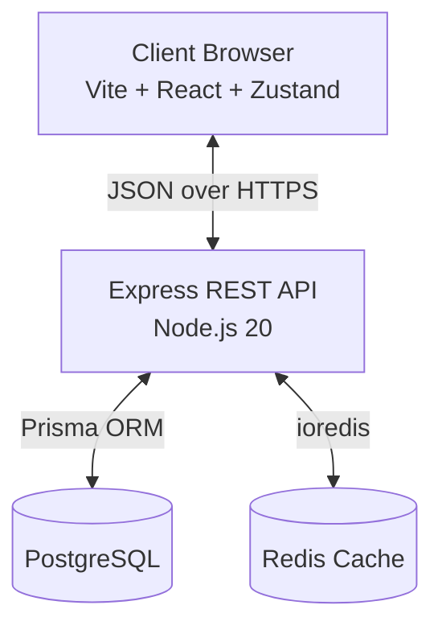
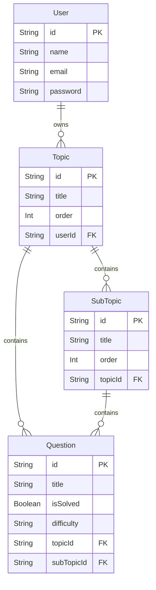

# AlgoForge Architecture

AlgoForge is a full-stack Data Structures and Algorithms (DSA) preparation platform. This document outlines the system design, technical decisions, and data flow.

## 1. High-Level System Overview

## 2. Backend Architecture (Layered)

The backend follows a strict layered architecture to separate concerns, making the system testable and maintainable.

| Layer | Responsibility | Technologies |
|---|---|---|
| **Routes** | Defines API endpoints and attaches middleware. | Express Router |
| **Middleware** | Intercepts requests for auth, validation, and security. | Zod, Helmet, JWT |
| **Controllers** | Thin adapters. Parses `req`, calls Service, sends `res`. | Express 5 |
| **Services** | Core business logic. No HTTP knowledge. | TypeScript |
| **Data Access** | Queries the database and cache. | Prisma, ioredis |

## 3. Authentication & Security Pipeline

AlgoForge uses stateless JWT authentication via `HttpOnly` cookies to protect against XSS attacks.

**Middleware Pipeline Order:**
1. `helmet()` — Sets secure HTTP headers.
2. `rateLimit()` — Prevents brute-force and DDoS (100 req / 15 min).
3. `sanitize()` — Strips dangerous keys from `req.body`.
4. `cookieParser()` — Parses `HttpOnly` cookies.
5. `requestId` / `requestLogger` — Injects traceability UUIDs and logs via Pino.
6. `protect` (Route-level) — Verifies JWT signature and expiry.
7. `validate` (Route-level) — Strict Zod schema enforcement.

## 4. Frontend Architecture

- **State Management:** `Zustand` is used for global state (topics, user session). It is chosen over Redux for its lightweight, boilerplate-free API.
- **Data Fetching:** Axios is used for API communication, with optimistic UI updates for rapid interactions (like toggling a question's solved status).
- **Drag-and-Drop:** `@dnd-kit` powers the reordering of topics, subtopics, and questions.

## 5. Caching Strategy

The most expensive operation in the system is fetching a user's full topic tree (Topics → SubTopics → Questions). This is optimized using a **Cache-Aside** pattern with Redis.

- **Key Format:** `topics:{userId}`
- **TTL:** 5 minutes
- **Invalidation:** Tag-based. The cache is tagged with `user:{userId}`. Any write operation (create, update, delete, reorder) in any service immediately invalidates the tag, ensuring absolute consistency.
- **Graceful Degradation:** If Redis is down or `REDIS_URL` is omitted, the `cache` utility silently falls back to direct Postgres queries without crashing the app.

## 6. Data Model (PostgreSQL)

## 7. Error Handling

Express 5 natively catches rejected promises, eliminating the need for `try/catch` in controllers. Errors bubble up to `errorHandler.ts`, which categorizes them:
- **ZodError:** 400 Bad Request with field-level details.
- **Prisma Errors:** e.g., `P2002` maps to 409 Conflict.
- **AppError:** Custom operational errors (e.g., 404 Not Found, 403 Forbidden).
- **Unknown Errors:** Logged via Pino and obscured as 500 Internal Server Error to prevent leaking stack traces.

## 8. Testing Infrastructure

- **Framework:** Vitest + Supertest.
- **Mocking:** `vitest-mock-extended` deeply mocks the `PrismaClient` and Redis utility.
- **Advantage:** Tests run entirely in-memory at lightning speed without requiring a live Docker database container.

## 9. Containerization

The project uses multi-stage Docker builds to minimize image sizes.
- **Builder Stage:** Installs all `devDependencies` and compiles TypeScript / Vite.
- **Runner Stage:** Copies only the compiled `dist/` folders and installs production dependencies, reducing attack surface and container size.
